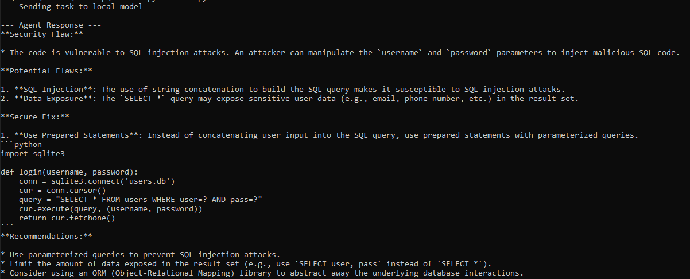

# Local AI Agent Harness Architecture

A hands-on implementation of a production-grade AI agent harness engineered entirely with open-source, local models. This repository demonstrates the programmatic evolution from a static prompt wrapper into an autonomous agent execution loop capable of interacting with the local file system.

---

## Architecture Evolution

### 1. Static Prompt Reviewer Harness (`agent.py`)
This script implements a foundational static AI prompt wrapper using the local `llama3.2:3b` model. It injects a rigid system instruction context to serve as a behavioral guardrail, forcing the local LLM to act strictly as an objective security code reviewer without user interface escape vectors. 

The harness packages a hardcoded vulnerable Python code block, executes it natively via the background API instance, and successfully handles the returned text streams. This stage verifies the reliability of local inference, token-handling constraints, and prompt-adherence metrics.

---