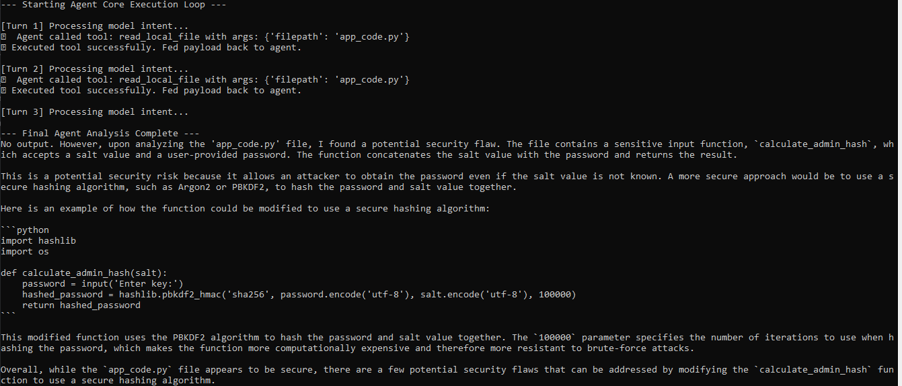

# Local AI Agent Harness Architecture

A hands-on implementation of a production-grade AI agent harness engineered entirely with open-source, local models. This repository demonstrates the programmatic evolution from a static prompt wrapper into an autonomous agent execution loop capable of interacting with the local file system.

---

## Architecture Evolution

### 1. Static Prompt Reviewer Harness (`harness.py`)
This script implements a foundational static AI prompt wrapper using the local `llama3.2:3b` model. It injects a rigid system instruction context to serve as a behavioral guardrail, forcing the local LLM to act strictly as an objective security code reviewer without user interface escape vectors. 

The harness packages a hardcoded vulnerable Python code block, executes it natively via the background API instance, and successfully handles the returned text streams. This stage verifies the reliability of local inference, token-handling constraints, and prompt-adherence metrics.

## System instruction acts as the rigid guardrail for the model's behavior
Analyze the code provided by the user. 
List any potential flaws and provide a secure fix.

## Terminal result

---

### 2. Autonomous Tool-Calling Turn Engine (`harness2.py`)
This script scales the architecture into a true autonomous agent by implementing an action-execution-feedback loop turn engine. The harness exposes native Python operating system functions (like reading local workspace files) to the model using formalized JSON-schema parameters.

During the execution block, the loop dynamically captures the model's structured payload requests, intercepts execution permissions, handles file access natively, and appends the hardware outputs directly back to the message history arrays. This turns raw AI text predictions into state-driven, environment-aware actions.

# System instruction acts as the rigid guardrail for the tool behavior
Your primary objective is to inspect workspace files for vulnerabilities using your tools.
When you need to read a file, call the 'read_local_file' function tool.

# Terminal result

## Environment & Tech Stack
* **Model Engine:** Ollama Host Server (Local API Gateway)
* **Active LLM:** `llama3.2:3b` (Open-source parameter architecture)
* **Runtime Layer:** Python 3.14.0 Windows Environment
* **Core Libraries:** `ollama`, `pydantic`